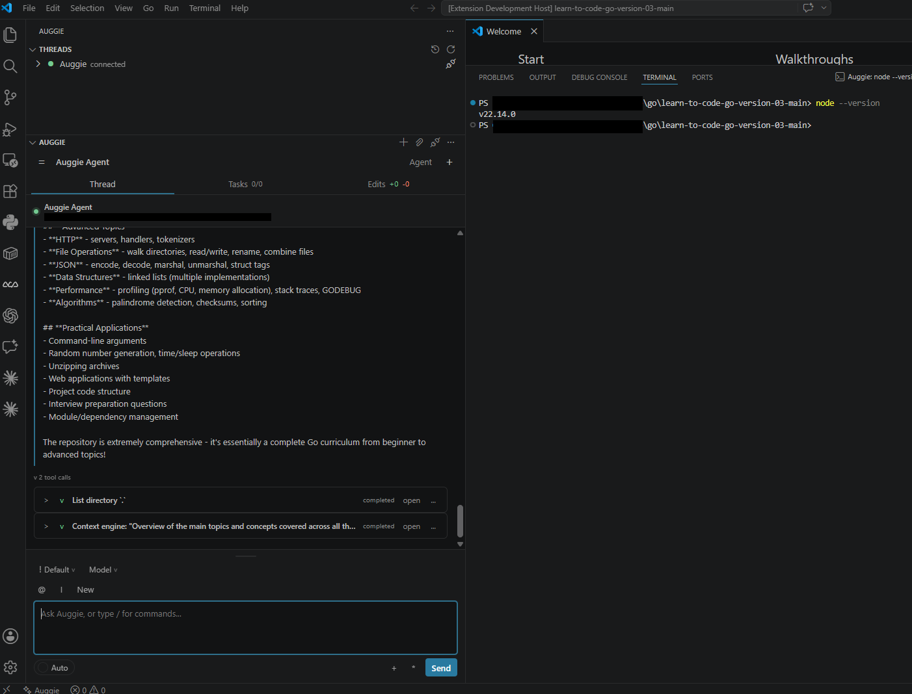

# Auggie Workbench

Auggie Workbench is a personal VS Code sidebar for the Auggie CLI, built on the Agent Client Protocol (ACP). It focuses on the coding-agent workflow: chat, thread history, task progress, visible terminal execution, action cards, and reviewable file changes in one workspace view.

This project is based on the open-source ACP Client for VS Code and has been adapted into a focused Auggie experience.



## Features

- **Auggie-first workflow**: Starts Auggie through `npx @augmentcode/auggie@latest --acp` by default.
- **Thread history**: Shows recent Auggie conversations in the Threads view and lets you reopen older threads when the agent exposes session support.
- **Workbench tabs**: Thread, Tasks, and Edits views keep chat, plan progress, and workspace changes close together.
- **Visible terminal bridge**: Provides a built-in MCP server with terminal command tools that run commands in the VS Code integrated terminal.
- **Reviewable action cards**: Tool calls expand into cards with command, file, search, URL, output, and preview details when the agent exposes them.
- **Edits review**: Shows changed files, line deltas, untracked files, binary labels, diff previews, Open/Diff actions, and guarded discard controls.
- **Composer context**: Supports file/folder context chips, recently opened files, selected-code context, and prompt controls.
- **ACP traffic and logs**: Keeps protocol and workbench output available for debugging.

## Requirements

- VS Code 1.85+
- Node.js 18+
- `npm` / `npx` available on your PATH
- Access to run `npx @augmentcode/auggie@latest --acp`
- Any Auggie authentication or account setup required by your environment

Work machines with locked-down network/proxy settings may need Node/npm/proxy configuration before Auggie can start through `npx`.

## Install From VSIX

Install the packaged build from this repository:

```powershell
code --install-extension auggie-workbench-0.2.3.vsix
```

Or in VS Code:

1. Open Extensions.
2. Choose `...`.
3. Select `Install from VSIX...`.
4. Pick `auggie-workbench-0.2.3.vsix`.
5. Reload VS Code.

The extension id is `local.auggie-workbench`, so it can be installed beside the original Augment extension without replacing it.

## First Smoke Test

1. Open a workspace in VS Code.
2. Open the Auggie activity view.
3. Wait for Auggie to connect, or run `Auggie: Start` from the Command Palette.
4. Send:

```text
Run node --version in the VS Code terminal.
```

Expected result:

- Auggie chooses the visible-terminal MCP tool.
- A VS Code integrated terminal opens or reuses an Auggie terminal.
- The terminal runs `node --version`.
- The thread shows an expandable completed tool card with command, terminal id, exit code, and output.

## Commands

Common commands are available from the Command Palette:

| Command | Description |
|---------|-------------|
| `Auggie: Start` | Start/connect Auggie |
| `Auggie: New Thread` | Start a new conversation |
| `Auggie: Focus Prompt` | Focus the prompt box |
| `Auggie: Stop` | Cancel the active turn |
| `Auggie: Restart` | Restart the Auggie process |
| `Auggie: Disconnect` | Disconnect the current Auggie process |
| `Auggie: Open Chat` | Focus the Auggie workbench |
| `Auggie: Open Latest Thread` | Open the latest known thread |
| `Auggie: Refresh Threads` | Refresh known threads |
| `Auggie: Show Log` | Open the Auggie Workbench log |
| `Auggie: Show Protocol Traffic` | Open ACP protocol traffic logs |

## Settings

| Setting | Default | Description |
|---------|---------|-------------|
| `auggie.agents` | Auggie CLI | Auggie launch command. Defaults to `npx @augmentcode/auggie@latest --acp`. |
| `auggie.mcpServers` | `{}` | Extra MCP servers to attach to each ACP session. Accepts Auggie-style object config or ACP-style arrays. |
| `auggie.autoApprovePermissions` | `ask` | Permission policy for agent actions. |
| `auggie.defaultWorkingDirectory` | `""` | Default working directory. Empty uses the current workspace. |
| `auggie.logTraffic` | `true` | Log ACP protocol traffic. |
| `auggie.autoConnectAuggie` | `true` | Automatically connect when the Auggie sidebar activates. |

### Custom Auggie Command

Use this when VS Code starts with the wrong Node.js version, when Node is installed in a custom location, or when the work machine needs an explicit binary path.

Open VS Code `settings.json` and set `auggie.agents`. You can use either User settings or Workspace settings.

On Windows, first find the binaries you want Auggie Workbench to use:

```powershell
where.exe node
where.exe npx
where.exe auggie
```

Or:

```powershell
Get-Command node,npx,auggie
```

On macOS, first find the binaries you want Auggie Workbench to use:

```bash
which node
which npx
which auggie
```

Or:

```bash
command -v node npx auggie
```

Recommended direct-binary form: put the Auggie binary in `command` and keep `--acp` in `args`.

```json
{
  "auggie.agents": {
    "Auggie CLI": {
      "command": "C:\\Users\\you\\AppData\\Roaming\\npm\\auggie.cmd",
      "args": ["--acp"],
      "env": {
        "AUGMENT_DISABLE_AUTO_UPDATE": "1"
      }
    }
  }
}
```

If Auggie is installed somewhere else, use that exact path. Homebrew on Apple Silicon often uses `/opt/homebrew/bin`; Intel/Homebrew or other installs may use `/usr/local/bin`:

```json
{
  "auggie.agents": {
    "Auggie CLI": {
      "command": "/opt/homebrew/bin/auggie",
      "args": ["--acp"],
      "env": {
        "AUGMENT_DISABLE_AUTO_UPDATE": "1"
      }
    }
  }
}
```

```json
{
  "auggie.agents": {
    "Auggie CLI": {
      "command": "/usr/local/bin/auggie",
      "args": ["--acp"],
      "env": {
        "AUGMENT_DISABLE_AUTO_UPDATE": "1"
      }
    }
  }
}
```

If you want to run Auggie through a specific Node installation, point `command` at that install's `npx.cmd`:

```json
{
  "auggie.agents": {
    "Auggie CLI": {
      "command": "C:\\Program Files\\nodejs\\npx.cmd",
      "args": ["@augmentcode/auggie@latest", "--acp"],
      "env": {
        "AUGMENT_DISABLE_AUTO_UPDATE": "1"
      }
    }
  }
}
```

On macOS, point `command` at the `npx` from the Node 22/23 install you want Auggie to use:

```json
{
  "auggie.agents": {
    "Auggie CLI": {
      "command": "/opt/homebrew/bin/npx",
      "args": ["@augmentcode/auggie@latest", "--acp"],
      "env": {
        "AUGMENT_DISABLE_AUTO_UPDATE": "1"
      }
    }
  }
}
```

```json
{
  "auggie.agents": {
    "Auggie CLI": {
      "command": "/usr/local/bin/npx",
      "args": ["@augmentcode/auggie@latest", "--acp"],
      "env": {
        "AUGMENT_DISABLE_AUTO_UPDATE": "1"
      }
    }
  }
}
```

For Node managers, use the active Node 22/23 path. Examples:

```json
{
  "auggie.agents": {
    "Auggie CLI": {
      "command": "C:\\Program Files\\nodejs\\npx.cmd",
      "args": ["@augmentcode/auggie@latest", "--acp"]
    }
  }
}
```

```json
{
  "auggie.agents": {
    "Auggie CLI": {
      "command": "C:\\Users\\you\\AppData\\Roaming\\nvm\\v22.14.0\\npx.cmd",
      "args": ["@augmentcode/auggie@latest", "--acp"]
    }
  }
}
```

```json
{
  "auggie.agents": {
    "Auggie CLI": {
      "command": "/Users/you/.nvm/versions/node/v22.14.0/bin/npx",
      "args": ["@augmentcode/auggie@latest", "--acp"]
    }
  }
}
```

```json
{
  "auggie.agents": {
    "Auggie CLI": {
      "command": "/Users/you/.asdf/installs/nodejs/22.14.0/bin/npx",
      "args": ["@augmentcode/auggie@latest", "--acp"]
    }
  }
}
```

Do not set `command` to `npx` and then pass a local Auggie binary path as the first arg. Use `npx` only for the package form:

```json
{
  "auggie.agents": {
    "Auggie CLI": {
      "command": "npx",
      "args": ["@augmentcode/auggie@latest", "--acp"]
    }
  }
}
```

Use the direct-binary form when you already have `auggie` installed. Use the `npx.cmd` form when you want npm to fetch/run `@augmentcode/auggie@latest` with a specific Node installation.

### Node Version

Auggie currently rejects Node 24. Use Node `>=22.14.0 <24` for the launch command. If the log shows `EBADDEVENGINES` or `Invalid engine "runtime"`, switch the VS Code/Auggie launch environment to Node 22 or 23 and restart Auggie Workbench.

### MCP Servers

Auggie Workbench always attaches its built-in visible-terminal MCP server. You can also attach your own MCP servers with `auggie.mcpServers`.

Use Auggie-style object config when copying from Auggie docs or another Auggie setup:

```json
{
  "auggie.mcpServers": {
    "docs-search": {
      "type": "stdio",
      "command": "node",
      "args": ["${workspaceFolder}/tools/docs-search-mcp.js"],
      "env": {
        "DOCS_ROOT": "${workspaceFolder}/docs"
      }
    }
  }
}
```

Use ACP-style array config if you already have that shape:

```json
{
  "auggie.mcpServers": [
    {
      "name": "local-tools",
      "type": "stdio",
      "command": "node",
      "args": ["${workspaceFolder}/tools/local-tools-mcp.js"],
      "env": [
        { "name": "PROJECT_ROOT", "value": "${workspaceFolder}" }
      ]
    }
  ]
}
```

HTTP/SSE MCP servers can be configured with `url` and optional headers:

```json
{
  "auggie.mcpServers": {
    "company-tools": {
      "type": "http",
      "url": "https://mcp.example.com/mcp",
      "headers": {
        "Authorization": "Bearer paste-token-here"
      }
    }
  }
}
```

To attach an MCP server only for the Auggie agent, put `mcpServers` inside that agent entry:

```json
{
  "auggie.agents": {
    "Auggie CLI": {
      "command": "npx",
      "args": ["@augmentcode/auggie@latest", "--acp"],
      "mcpServers": {
        "repo-tools": {
          "type": "stdio",
          "command": "node",
          "args": ["${workspaceFolder}/tools/repo-tools-mcp.js"]
        }
      }
    }
  }
}
```

`${workspaceFolder}` expands in MCP `command`, `args`, and `url`. Environment values are passed literally, so use absolute paths there if your MCP server needs them.

### Working Directory

By default, Auggie starts in the first workspace folder. In a monorepo, set `auggie.defaultWorkingDirectory` if Auggie should run from a subfolder:

```json
{
  "auggie.defaultWorkingDirectory": "C:\\Users\\you\\Documents\\codebase\\my-repo\\apps\\web"
}
```

macOS example:

```json
{
  "auggie.defaultWorkingDirectory": "/Users/you/code/my-repo/apps/web"
}
```

### Safety And Debug Toggles

Keep permissions on `ask` unless you intentionally want Auggie actions to run without prompts:

```json
{
  "auggie.autoApprovePermissions": "ask"
}
```

Use `allowAll` only in workspaces where you are comfortable with the agent running approved actions without stopping to ask:

```json
{
  "auggie.autoApprovePermissions": "allowAll"
}
```

Turn on protocol traffic logs while debugging session, tool, or MCP behavior:

```json
{
  "auggie.logTraffic": true
}
```

Disable auto-connect if you want Auggie to start only when you run `Auggie: Start`:

```json
{
  "auggie.autoConnectAuggie": false
}
```

## Built-In Terminal MCP Tools

Auggie Workbench automatically attaches a local MCP server named `auggie-vscode-terminal` to Auggie sessions. It exposes these equivalent tools:

- `run_command_in_vscode_terminal`
- `run_terminal_command`
- `run_command`
- `run_in_vscode_terminal`

All four forward to the same local extension bridge and run commands through the VS Code integrated terminal when possible.

## Development

```powershell
npm install
cmd /c npm run compile
cmd /c npm run lint
```

Press `F5` in VS Code to launch the Extension Development Host.

Package a VSIX:

```powershell
cmd /c npx vsce package --out auggie-workbench-0.2.3.vsix
```

## Current Limitations

- Auggie decides which tools to use; the terminal MCP bridge makes visible terminal execution available but does not force every command through it.
- Tasks depend on ACP plan updates or recovered plan-like assistant text.
- Some action-card details depend on what Auggie exposes in ACP tool payloads.
- Terminal output previews still need additional ANSI/OSC/control-sequence cleanup.
- Checkpoints are planned but not implemented yet.

## License

MIT. See [LICENSE](LICENSE) for details.
